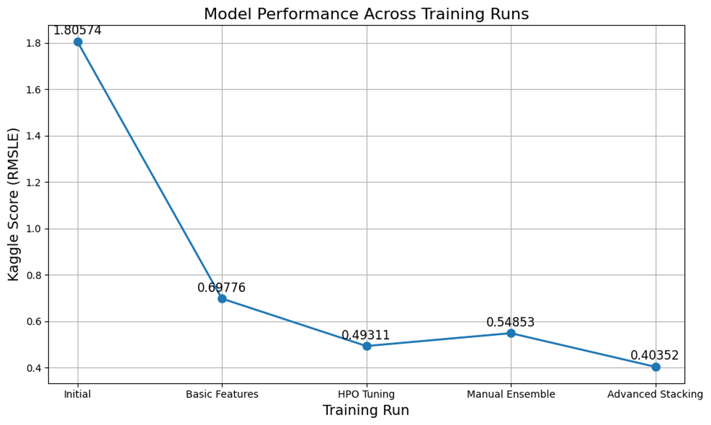

# Report: Predict Bike Sharing Demand with AutoGluon Solution
#### Nathan Quadrio

## Initial Training
### What did you realize when you tried to submit your predictions? What changes were needed to the output of the predictor to submit your results?
Before submission, I verified the predictions using ```predictions.describe()``` and confirmed that there were no negative values. As a result, no adjustments were needed to the output. Each submission successfully received a score from Kaggle.

### What was the top ranked model that performed?
TODO: Add your explanation

## Exploratory data analysis and feature creation
### What did the exploratory analysis find and how did you add additional features?
The EDA revealed insights into feature distributions and the presence of categorical variables, highlighting the importance of temporal and weather-related factors in bike rental demand. Based on these insights, additional features were engineered, including extracting datetime components such as hour, day, month, dayofweek, and year. Moreover, categorical variables like ```season``` and ```weather``` were explicitly defined, and further features such as ```rush_hour``` (peak usage times), ```is_weekend``` (weekend indicator), and categorized versions of temperature (temp_category) and humidity (humidity_category) were introduced. These enhancements allowed the models to better capture patterns and relationships in the data, leading to improved prediction performance.

### How much better did your model preform after adding additional features and why do you think that is?
After adding additional features (hour, day, month, day of week), the model’s performance improved significantly, reducing the Kaggle score from 1.80574 to 0.69776. Ultimately, with further feature engineering enhancements (rush hour, weekend indicators, temperature and humidity categories), log-transforming the target, advanced hyperparameter tuning, and a stacking ensemble approach, the score improved to 0.40352. The substantial improvement is primarily because these new features allowed the model to capture critical temporal patterns, seasonal trends, and weather-related effects, providing richer context and better predictive power.

## Hyper parameter tuning
### How much better did your model preform after trying different hyper parameters?
After hyperparameter tuning (using Bayesian Optimization and longer training), the model’s Kaggle score improved significantly from 0.69776 to 0.49311. This substantial improvement (approximately 29% better) was due to finding optimal hyperparameter combinations, allowing models like LightGBM, XGBoost, and CatBoost to better fit the data and generalize more effectively.

### If you were given more time with this dataset, where do you think you would spend more time?
If given more time, I’d focus primarily on deeper feature engineering, particularly exploring interactions between features (e.g., combinations of weather and hour, holiday indicators, and finer-grained seasonal trends). Additionally, I would further invest in advanced hyperparameter optimization for individual models and experiment more extensively with sophisticated ensemble techniques, such as stacking or blending with diverse base models, to squeeze out additional predictive performance.

### Create a table with the models you ran, the hyperparameters modified, and the kaggle score.
|Step|Model|Hyperparameter Modified|Kaggle Score|
|--|--|--|--|
||?|?|?|
|add_features|?|?|?|
|hpo|?|?|?|

### Create a line plot showing the top model score for the three (or more) training runs during the project.

TODO: Replace the image below with your own.



### Create a line plot showing the top kaggle score for the three (or more) prediction submissions during the project.

TODO: Replace the image below with your own.


## Summary
TODO: Add your explanation
